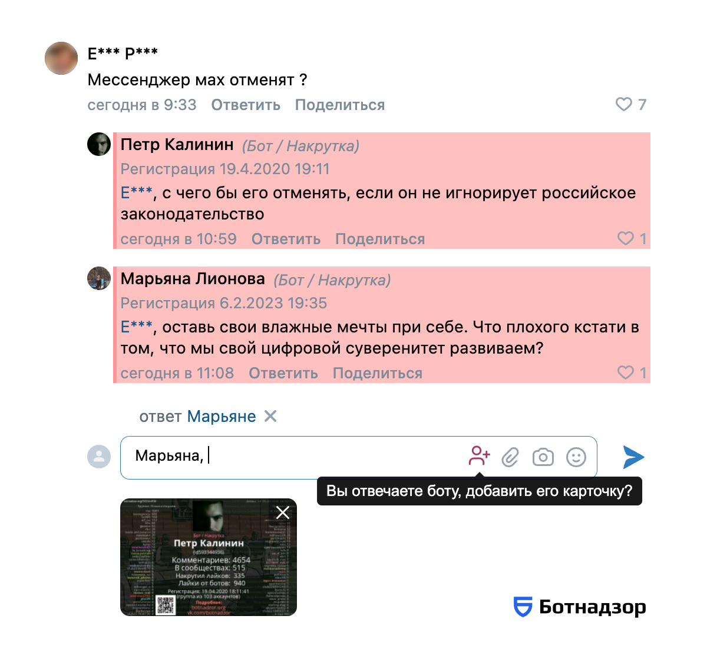

# Расширение Ботнадзор<br><em>Botnadzor extension</em>

_Botnadzor browser extension highlights bots on [vk.com](https://vk.com) and VK-related sites.  
Learn more at [botnadzor.org/extension](https://botnadzor.org/extension) (ru)._

_For the English version of this README, [see it on Google Translate](https://translate.google.com/translate?sl=ru&tl=en&u=https://github.com/botnadzor/extension/blob/main/README.md)._

---

[](https://chromewebstore.google.com/detail/%D0%B1%D0%BE%D1%82%D0%BD%D0%B0%D0%B4%D0%B7%D0%BE%D1%80-botnadzororg/loemeolcemafljepnnmgjcoibcbocoma)
[](https://addons.mozilla.org/ru/firefox/addon/botnadzor-org/)
[](LICENSE.md)
[](https://github.com/botnadzor/extension/actions/workflows/ci.yaml)

Браузерное расширение Ботнадзор подсвечивает ботов на [vk.com](https://vk.com) и связанных сайтах.  
Подробнее о расширении: [botnadzor.org/extension](https://botnadzor.org/extension).

## Что делает расширение



- Подсвечивает ботов на сайтах VK: ([m.](https://m.vk.com))[vk.com](https://vk.com), ([m.](https://m.vk.ru))[vk.ru](https://vk.ru), ([m.](https://m.vkvideo.ru))[vkvideo.ru](https://vkvideo.ru), а также на веб-архиве: [web.archive.org](https://web.archive.org)
- Упрощает вставку [карточек ботов](https://botnadzor.org/docs/how-to-help#cards) в ответ на их комментарии
- Позволяет узнавать дату регистрации аккаунтов VK
- Позволяет изучать подозрительную активность аккаунтов с помощью встроенного инспектора
- Позволяет отправлять подозрительные аккаунты на проверку администраторам Ботнадзора

## Установка из магазина браузера

Для большинства пользователей рекомендуется установка стабильной версии расширения из магазина браузера.

| ⚠️ Внимание                                                                                                                                                                                                              |
| :----------------------------------------------------------------------------------------------------------------------------------------------------------------------------------------------------------------------- |
| В браузерных магазинах пока что опубликована версия 1.x. Этот репозиторий содержит версию 2.x, которая доделывается. Бета-версии 2.0.0 публикуются в [GitHub Releases](https://github.com/botnadzor/extension/releases). |

### Браузеры на&nbsp;базе&nbsp;Chromium

_**Chrome**, **Edge**, **Yandex**, **Opera**, **Brave**, **Lemur** и&nbsp;т.д._  
_для Windows, Android, macOS и Linux_

1.  Перейдите на [страницу расширения в каталоге Chrome](https://chromewebstore.google.com/detail/%D0%91%D0%BE%D1%82%D0%BD%D0%B0%D0%B4%D0%B7%D0%BE%D1%80%20%28botnadzor.org%29/loemeolcemafljepnnmgjcoibcbocoma)

1.  В правом верхнем углу страницы нажмите кнопку _«Добавить»_  
    _Надпись на кнопке может быть немного другой, она зависит от браузера_

1.  Откройте VK-паблик, где часто бывают боты  
    _например, [ria](https://vk.com/ria), [rt_russian](https://vk.com/rt_russian), [vesti](https://vk.com/vesti), [mash](https://vk.com/mash)_

    Теперь вы видите ботов в комментариях и&nbsp;профилях&nbsp;VK!

Пожалуйста, [поддержите наш проект](https://botnadzor.org/docs/how-to-help) донатом, а&nbsp;также оставляйте [карточки ботов в&nbsp;VK](https://botnadzor.org/docs/how-to-help#cards) и&nbsp;подпишитесь [на&nbsp;наши&nbsp;соцсети](https://botnadzor.org/docs/how-to-help#subscribe).

### Firefox

_В том числе **TOR Browser**_

1.  Перейдите на [страницу расширения в каталоге Firefox](https://addons.mozilla.org/ru/firefox/addon/botnadzor-org/)

1.  Нажмите кнопку _«Добавить в Firefox»_

1.  Откройте VK-паблик, где часто бывают боты  
    _например, [ria](https://vk.com/ria), [rt_russian](https://vk.com/rt_russian), [vesti](https://vk.com/vesti), [mash](https://vk.com/mash)_

    Теперь вы видите ботов в комментариях и&nbsp;профилях&nbsp;VK!

Пожалуйста, [поддержите наш проект](https://botnadzor.org/docs/how-to-help) донатом, а&nbsp;также оставляйте [карточки ботов в&nbsp;VK](https://botnadzor.org/docs/how-to-help#cards) и&nbsp;подпишитесь [на&nbsp;наши&nbsp;соцсети](https://botnadzor.org/docs/how-to-help#subscribe).

## Установка из GitHub Releases

Этот способ подходит тем, кто хочет помочь с поиском ошибок в экспериментальных версиях.

1.  Откройте страницу релизов ([github.com/botnadzor/extension/releases](https://github.com/botnadzor/extension/releases)) и выберите нужную версию (скорее всего, наиболее свежую).

    В блоке `Assets` релиза найдите архив для вашего браузера и скачайте его:  
    `botnadzor-for-BROWSER-VERSION.zip`

    ℹ️ `chrome` подходит для всех браузеров на базе Chromium: **Chrome**, **Edge**, **Yandex**, **Opera**, **Brave**, **Lemur** и&nbsp;т.д.

    ⚠️ Файл `*.sources.zip` **не нужен** (это исходный код для отправки в магазины браузеров).

1.  Откройте страницу расширений в браузере:
    - Chrome: `chrome://extensions`
    - Firefox: `about:addons`

    Если у вас уже установлено наше расширение из магазина, **не удаляйте его**.
    В списке установленных расширений найдите _Ботнадзор_ и временно отключите.

1.  Установите скачанный архив:
    - обычно достаточно перетащить (`drag and drop`) zip-файл в окно страницы расширений;
    - если перетаскивание не срабатывает, используйте пункт «Установить из файла» в меню расширений.

1.  После установки откройте попап Ботнадзора (иконка расширения) и проверьте версию.
    Она должна совпадать с релизом, который вы скачали (например, `2.0.0-beta.1`).

1.  Если захотите вернуться на стабильную версию из магазина, отключите экспериментальную версию и снова включите магазинную.

## Архитектура

Расширение построено на [WXT](https://wxt.dev) с использованием [React](https://react.dev), [TypeScript](https://www.typescriptlang.org) и [TailwindCSS](https://tailwindcss.com).
Интерфейсные компоненты основаны на [Shadcn UI](https://ui.shadcn.com) и [Radix UI](https://www.radix-ui.com).
Данные обрабатываются при помощи [Zod](https://zod.dev), [Dexie](https://dexie.org) и [ORPC](https://orpc.dev).
Иконки взяты из [Lucide](https://lucide.dev).

У расширения три точки входа:

- **Background** (service worker) — регистрирует сервисы, управляет данными и конфигурацией
- **Content script** — модифицирует DOM на страницах VK через систему вставок (_insertions_) — модульных DOM-модификаций с автоматической очисткой
- **Popup** — показывает меню расширения с настройками, объявлениями и статистикой

Связь _background_ с _content script_ и _popup_ реализована через библиотеку [`@webext-core/proxy-service`](https://www.npmjs.com/package/@webext-core/proxy-service).

Подробное описание архитектуры, паттернов и соглашений — в [AGENTS.md](AGENTS.md) (на английском).

## Разработка

### Требования

- [Node.js 24](https://nodejs.org/en/download) (точная версия указана в `.tool-versions`, но подойдёт любая версия ≥ 24.0)
- [pnpm 10](https://pnpm.io/installation) (точная версия указана в `package.json` → `packageManager`, но подойдёт любая версия ≥ 10.0)

### Установка зависимостей

```bash
pnpm install
```

### Запуск в режиме разработки

```bash
pnpm dev:chrome  ## Chrome с живой перезагрузкой изменений
pnpm dev:firefox ## Firefox с живой перезагрузкой изменений
```

Сервер разработки автоматически запускает чистую копию браузера и открывает тестовую страницу на сайте VK.

Файлы сборки доступны в директории `dist/`.
При желании их можно вручную добавить в свой основной браузер.

### Локальная сборка

```bash
pnpm build         ## Chrome + Firefox
pnpm build:chrome  ## только Chrome
pnpm build:firefox ## только Firefox
```

Файлы сборки доступны в директории `dist/`.
При желании их можно вручную добавить в свой основной браузер.

### Линтинг (статические проверки кода)

```bash
pnpm lint ## все проверки: ESLint, Prettier, TypeScript, knip, cspell, pnpm dedupe
pnpm fix  ## автоматическое исправление некоторых типов проблем
```

Отдельные проверки доступны как `pnpm lint:eslint`, `pnpm lint:tsc` и т.д. — полный список в `package.json`.

### Юнит-тесты

```bash
pnpm test:unit         ## прогон всех юнит-тестов один раз
pnpm test:unit --watch ## запуск юнит-тестов в режиме наблюдения
```

## CI/CD <sup>[_что это?_](https://ru.wikipedia.org/wiki/CI/CD)</sup>

CI запускается для пулл-реквестов и для новых коммитов в ветке `main`.
Используются [GitHub Actions](https://github.com/features/actions).
Проверки состоят из двух параллельных задач:

- _build_ (упаковка расширения для обоих браузеров)
- _lint and test_ (прогон всех линтеров и юнит-тестов)

Ручной запуск линтеров и юнит-тестов локально позволяет заранее поймать проблемы, которые могут возникнуть в CI.

## Обратная связь и вклад

Если вы нашли ошибку или хотите предложить улучшение, создайте [issue](https://github.com/botnadzor/extension/issues) или дополните уже существующее.
Если вы хотите внести изменения в код или документацию, создайте [pull request](https://github.com/botnadzor/extension/pulls).

Подробнее о проекте Ботнадзор и о способах связи — на странице [botnadzor.org/docs](https://botnadzor.org/docs).
Если сайт недоступен, воспользуйтесь нашим телеграм-ботом [@botnadzor_org_bot](https://t.me/botnadzor_org_bot).

## Лицензия

[BSD-3-Clause](LICENSE.md)
